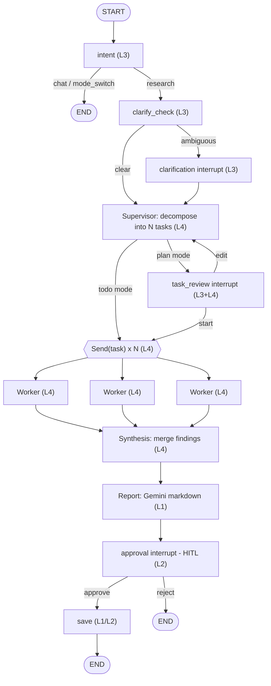

# Deep Research Agent — Level 4 (Multi-Agent)

An AI-powered deep research web application. Enter a topic and the agent decomposes it into independent research tasks, runs them in parallel across stateless worker agents, synthesizes the findings, generates a comprehensive Markdown report with Gemini, and (after your approval) saves it to disk — streaming every step live to the UI.

The system was built incrementally across four levels. This README is organized so you can see **which feature belongs to which level** and **which files implement it**.

---

## Feature levels at a glance

| Level | Theme | What it adds | Key files |
| ----- | ----- | ------------ | --------- |
| **Level 1** | Core pipeline | Web search → report generation → save, streamed over SSE | `tools/search_tool.py`, `services/gemini_service.py`, `tools/save_report_tool.py`, `main.py` |
| **Level 2** | Human-in-the-loop | Approval checkpoint **before** the report is written to disk | `approval_node`/`save_node` in `graph/research_graph.py`, `ApprovalCard` in `ChatPanel.tsx` |
| **Level 3** | Modes + clarification | Todo/Plan modes, intent classification, ambiguous-query clarification | `services/intent_service.py`, `services/clarification_service.py`, `ModeToggle.tsx`, `ClarificationCard.tsx`, `PlanViewer.tsx` |
| **Level 4** | Multi-agent | Supervisor decomposition → parallel workers → synthesis (fan-out/fan-in) | `services/supervisor_service.py`, `services/worker_service.py`, `services/synthesis_service.py`, `AgentActivity.tsx` |

---

## Architecture (Level 4)



**Fan-out / fan-in:** the Supervisor emits a list of `Send("worker", {...})` objects, so LangGraph spawns one parallel worker per task. All workers write into a single reducer-backed list (`findings: Annotated[list, operator.add]`); because `worker → synthesis` is a normal edge, `synthesis` runs exactly once after the whole parallel superstep completes.

### How the pipeline evolved

```
Level 1:   search ─────────────► generate ─► save
Level 2:   search ─► generate ─► [APPROVAL] ─► save
Level 3:   intent ─► clarify ─► (plan review) ─► search ─► generate ─► [APPROVAL] ─► save
Level 4:   intent ─► clarify ─► supervisor ─► (task review) ─► ⇶ workers ⇶ ─► synthesis ─► report ─► [APPROVAL] ─► save
                                                              (parallel)
```

---

## How it works, by level

### Level 1 — Core research pipeline
- `tools/search_tool.py` — Tavily web search.
- `services/gemini_service.py` — `generate_report()` turns research context into a structured Markdown report (Gemini 3.1 Flash Lite). *In Level 4 it consumes the Synthesis output instead of raw search results.*
- `tools/save_report_tool.py` — writes the report to `data/reports/report_<timestamp>.md`.
- `main.py` — FastAPI app that drives the LangGraph and streams progress as Server-Sent Events (SSE).

### Level 2 — Human-in-the-loop (HITL) save approval
After the report is generated it is shown in the right panel, then the graph **pauses** (`approval_node` interrupt) and asks you to approve or reject saving.

**Why the checkpoint sits before the file save:**
- LLM reports can contain hallucinations or unverified claims even when the pipeline runs successfully.
- Auto-saving every output would accumulate low-quality or incorrect artifacts on disk.
- Gating the save keeps `data/reports/` a curated set of outputs you have explicitly reviewed and accepted.

Approve → report is written to disk. Reject → it stays visible for the session but is never persisted. (The UI Download button is separate — it saves to your browser, not the server, and needs no approval.)

### Level 3 — Modes, intent, and clarification

#### Mode management — design decision: *when Plan Mode triggers*
- Two modes exist: **Todo** (default) and **Plan**. The active mode is chosen by the user, never silently by the model.
- You switch modes via the **ModeToggle** in the chat header, or with **slash commands**: `/plan`, `/todo`, `/research` (`/research` is an alias for Todo). A bare `/plan` just switches the mode; `/plan <topic>` switches and runs in one step.
- The mode is persisted in `sessionStorage`, so it survives page refreshes.
- `services/intent_service.py` also classifies each message as `research`, `chat`, or `mode_switch`. A pure mode-change sentence ("let's plan first") flips the mode via the `mode_switch` event; conversational messages get a friendly `chat` reply without starting research. A concrete topic always classifies as `research`, even if it mentions a mode.
- **When does Plan Mode actually pause?** Only in Plan Mode does the graph stop for review after decomposition (`task_review` interrupt). Todo Mode never pauses for review — it goes straight to execution. So "Plan vs Todo" reduces to a single question: *do you want to review the plan before work starts?*

#### Clarification — design decision: *how the dialog is used*
- `services/clarification_service.py` (`clarify_check_node`) runs **once, up front, for every research query in both modes**, before any decomposition or search.
- It is **conservative by design**: it only interrupts when the query is genuinely ambiguous, and on any model/parse failure it returns "no clarification needed" so it can never block research.
- When it does trigger, the graph interrupts and the UI shows a **ClarificationCard** with the question plus 2–4 distinct options. Your answer is appended to the original query as a focus hint (e.g. `"...power grid (focus: technical challenges)"`) and the refined query flows through the rest of the pipeline.
- Rationale for running it first and independently of mode: disambiguating the topic up front improves both the Supervisor's decomposition and every worker's search, and keeps a single, predictable place for the human to steer scope.

### Level 4 — Multi-agent distributed research

The single research agent is replaced by three cooperating roles:

- **Supervisor** (`services/supervisor_service.py`) — `decompose()` splits **any** query into 3–6 independent, non-overlapping, parallelizable sub-tasks. Decomposition is **fully dynamic**: the prompt forbids fixed domain buckets (no "market / tech / open-source" templates); every task is tailored to the specific topic. It also supports regeneration from a natural-language instruction (used by Plan Mode review).
- **Research Workers** (`services/worker_service.py`) — identical, **stateless** units. Each `run_task()` sees only its own task, runs a Tavily search, then uses Gemini to extract structured findings. Workers are **not** domain specialists — parallelism is **task-based, not role-based**. A failing worker returns an error-note finding so one failure never aborts the run (graceful degradation).
- **Synthesis** (`services/synthesis_service.py`) — `synthesize()` merges all worker findings into one coherent, de-duplicated, logically ordered synthesis, which the Level 1 report generator turns into the final document.

**Frontend:** `AgentActivity.tsx` renders the live multi-agent view in the left panel — Supervisor status, a per-worker task list with running/completed indicators, and Synthesis status — driven by the new `tasks`, `task_progress`, and `synthesis` SSE events.

#### Plan Mode: what changed from Level 3 → Level 4, and why

| | Level 3 Plan Mode | Level 4 Plan Mode |
| --- | --- | --- |
| What you review | A fixed **4-step procedural pipeline** ("define scope → search → analyze → report"), reworded per topic | The Supervisor's **dynamic task decomposition** — the actual N independent research sub-tasks |
| Is it meaningful? | The steps were essentially identical every run; editing changed wording, not the work | Editing/regenerating changes the **real units of parallel work** that get dispatched |
| Execution | Linear single-agent pipeline | Fan-out to parallel workers after approval |
| Backend | `plan_node` + `plan_service.py` (now removed) | `supervisor_node` + `task_review` interrupt |

**Why it changed:** in Level 4 the consequential planning artifact is the *task decomposition*, because it determines what is actually researched in parallel. A fixed 4-step pipeline plan no longer reflects how the system runs and would always look the same. So Plan Mode was **unified with the Supervisor**: it now shows the decomposed tasks for review, and "Regenerate" re-runs the Supervisor with your instruction. Todo and Plan modes now share the exact same multi-agent pipeline and differ only in whether the decomposition pauses for human review (`task_review`) before fan-out. The old `plan_service.py` was deleted to avoid a redundant, divergent code path.

---

## Tech Stack

| Layer     | Technology                                        |
| --------- | ------------------------------------------------- |
| Frontend  | Next.js 16 (App Router), TypeScript, Tailwind CSS |
| Backend   | Python, FastAPI, LangGraph                        |
| LLM       | Gemini 3.1 Flash Lite (via LangChain)             |
| Search    | Tavily                                            |

---

## Project Structure

Each entry is tagged with the level that introduced it.

```
deepresearch-agent-test/
├── backend/
│   ├── app/
│   │   ├── main.py                       # FastAPI app, SSE stream, session store        (L1→L4)
│   │   ├── graph/
│   │   │   └── research_graph.py         # LangGraph: all nodes, routers, Send fan-out   (L1→L4)
│   │   ├── tools/
│   │   │   ├── search_tool.py            # Tavily web search                             (L1)
│   │   │   └── save_report_tool.py       # Save markdown report to disk                  (L1)
│   │   └── services/
│   │       ├── gemini_service.py         # Report generation (from synthesis in L4)      (L1)
│   │       ├── intent_service.py         # Classify research / chat / mode_switch        (L3)
│   │       ├── clarification_service.py  # Detect ambiguous queries, build options       (L3)
│   │       ├── supervisor_service.py     # Dynamic task decomposition                    (L4)
│   │       ├── worker_service.py         # Stateless worker: search + extract            (L4)
│   │       └── synthesis_service.py      # Merge worker findings into a synthesis         (L4)
│   ├── requirements.txt
│   └── .env.example
├── frontend/
│   ├── app/
│   │   ├── layout.tsx
│   │   ├── page.tsx                      # Root state + session orchestration            (L1→L4)
│   │   └── globals.css
│   ├── components/
│   │   ├── ChatPanel.tsx                 # Chat, status bar, input, ApprovalCard         (L1/L2)
│   │   ├── ReportPanel.tsx               # Markdown report viewer + download             (L1)
│   │   ├── ModeToggle.tsx                # Todo / Plan toggle                            (L3)
│   │   ├── ClarificationCard.tsx         # Clarification question + options              (L3)
│   │   ├── PlanViewer.tsx                # Review/regenerate the decomposed task list    (L3→L4)
│   │   └── AgentActivity.tsx             # Live Supervisor / Workers / Synthesis view    (L4)
│   ├── lib/
│   │   └── api.ts                        # SSE streaming client + handlers               (L1→L4)
│   └── .env.local.example
├── data/
│   └── reports/                          # Approved .md reports saved here               (L1)
└── README.md
```

---

## Prerequisites

- Python 3.11+
- Node.js 18+
- A [Gemini API key](https://aistudio.google.com/app/apikey)
- A [Tavily API key](https://app.tavily.com)

---

## Setup

### 1. Backend

```bash
cd backend

# Create and activate a virtual environment
python -m venv venv
# Windows
venv\Scripts\activate
# macOS/Linux
source venv/bin/activate

# Install dependencies
pip install -r requirements.txt

# Configure environment
copy .env.example .env        # Windows
# cp .env.example .env        # macOS/Linux
# Edit .env and add your API keys
```

`.env` file:
```
GEMINI_API_KEY=your_gemini_api_key_here
TAVILY_API_KEY=your_tavily_api_key_here
```

Start the backend (from the `backend/` directory):
```bash
uvicorn app.main:app --reload --port 8080
```

### 2. Frontend

```bash
cd frontend

# Install dependencies
npm install

# Configure environment (optional — defaults to http://localhost:8080)
copy .env.local.example .env.local   # Windows
# cp .env.local.example .env.local   # macOS/Linux

# Start the development server
npm run dev
```

Open [http://localhost:3000](http://localhost:3000).

---

## API

### `POST /api/research` (L1, extended through L4)
Starts a new research session and returns an SSE stream.

**Request body:**
```json
{ "query": "impact of electric vehicles on the power grid", "mode": "todo" }
```
`mode` is `"todo"` (default) or `"plan"`.

### `POST /api/research/continue` (L2/L3)
Resumes a session paused at an interrupt. The `resume` value is interpreted by whichever node is waiting.

```json
{ "execution_id": "abc-123", "resume": <value> }
```

| Paused at | `resume` value | Level |
| --- | --- | --- |
| clarification | `"<chosen option>"` | L3 |
| task review — start | `{ "action": "start" }` | L4 |
| task review — regenerate | `{ "action": "edit", "instruction": "<text>" }` | L4 |
| save approval | `true` (save) / `false` (skip) | L2 |

### `GET /health` (L1)
Returns `{"status": "ok"}`.

### SSE event types (tagged by level)

| Event | Fields | Level |
| --- | --- | --- |
| `status` | `message` | L1 |
| `report` | `content` | L1 |
| `done` | — | L1 |
| `error` | `message` | L1 |
| `approval_required` | `execution_id`, `message` | L2 |
| `chat` | `content` | L3 |
| `mode_switch` | `target`, `message` | L3 |
| `clarification_required` | `execution_id`, `message`, `options` | L3 |
| `plan_review` | `execution_id`, `plan` (task titles) | L3→L4 |
| `tasks` | `execution_id`, `tasks: [{id, title}]` | L4 |
| `task_progress` | `task_id`, `status` | L4 |
| `synthesis` | `status` (`running`/`completed`) | L4 |

**Example stream (Todo mode):**
```
data: {"type": "tasks", "execution_id": "abc", "tasks": [{"id":1,"title":"..."}, {"id":2,"title":"..."}]}
data: {"type": "status", "message": "Supervisor decomposed the topic into 4 research tasks."}
data: {"type": "task_progress", "task_id": 3, "status": "completed"}
data: {"type": "task_progress", "task_id": 1, "status": "completed"}
data: {"type": "synthesis", "status": "running"}
data: {"type": "synthesis", "status": "completed"}
data: {"type": "report", "content": "# ...markdown..."}
data: {"type": "approval_required", "execution_id": "abc", "message": "Report generated. Do you want to save it to disk?"}
```
(`task_progress` events typically arrive out of task order — that is the parallel workers finishing independently.)

---

## Generated Reports

Approved reports are saved as Markdown files in `data/reports/`:
```
data/reports/report_20260617_120000.md
```
You can also download the current report from the UI (browser download, no approval required).

---

## Implementation notes & tradeoffs

- **Concurrency cap:** worker fan-out is capped via `max_concurrency=4` in `main.py` to avoid Gemini/Tavily rate limits; the Supervisor is bounded to 3–6 tasks. Tune both if you hit `RESOURCE_EXHAUSTED`.
- **Per-task "running" state:** the UI infers "running" from fan-out start (all workers start together) and flips each to "completed" on its `task_progress` event. For exact per-worker start events you could emit a custom LangGraph stream from inside `worker_node`.
- **Two LLM stages in L4:** synthesis and report are separate Gemini calls for clarity; they could be merged to cut latency/cost.
